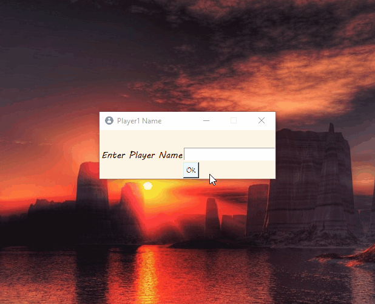

# Tic-Tac-Toe-Game
Tic-Tac-Toe Game In Python 3.8.2 Tkinter Gui Module With 3 Different Difficulty Levels Easy, Medium &amp; Hard Vs Computer. Along With Player Vs Player Option.

All Resources Use In This Project Is Downloaded From Google And It's Bellong To Their Respective Owners.

Dependencies:
  
  Python3
  
  Tkinter
  
  etc.

Tested On Platforms:

  Windows

Clone The Repo Or Download It And Run..

Demo:

Important  Notice:-
    
    Sometimes Some Unwanted Things Occur In Player Vs Player Mode.
    If You Notice Some Thing Like That Please Take A Screen Shoot And Mail Me at hrishikesh.pgh.patra@gmail.com
    Or Just Put A Comment Or Create A Issue In This Github Repository.
    
    
    Your Idle May Be Show
    ----> Undefined variable: 'g_gameEnd' at line [440,8] <----- This Warning 
    Don't Panic This Is Not An Error & This Warning Doesn't Create Any Problem.
    
    In Source Folder You Can Find This --> libmpg123.dll <--- File
    If You Want You Can Delete This File, This Is Only For Fix libmpg123.dll error In Pyinstaller.

Drop a STAR if you like it!!! 😃
